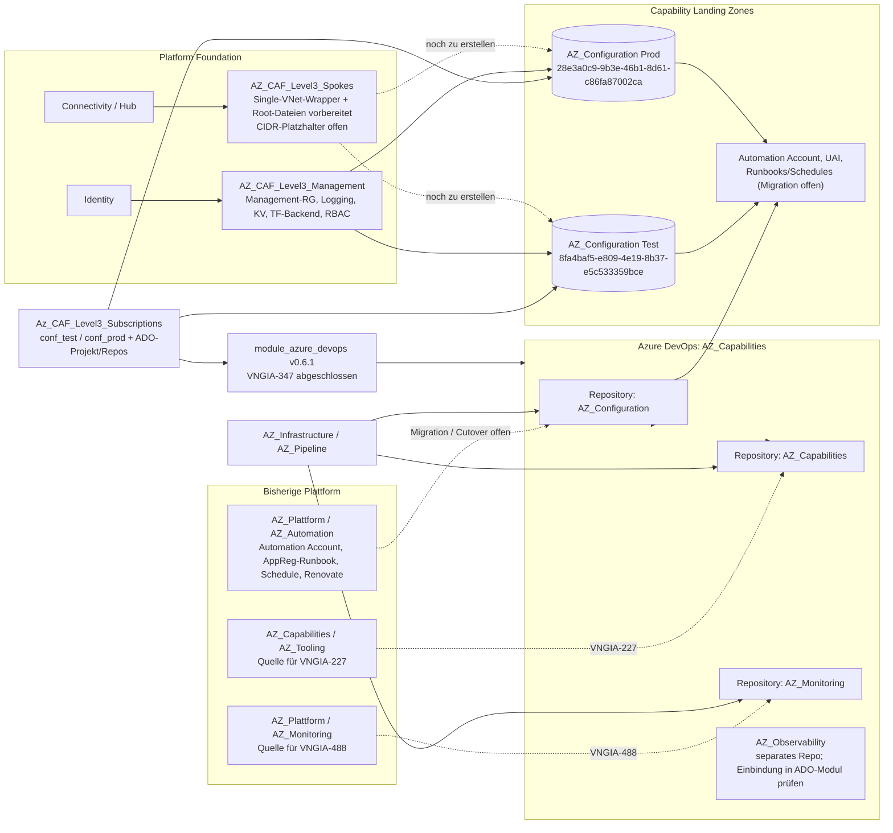

# VNG — Capabilities-Migration: Gesamtbericht (lebendes Dokument)

> Wird laufend aktualisiert, sobald neue Fortschritte vorliegen. Letztes Update: **08.10.2026**
> Wird laufend aktualisiert, sobald neue Fortschritte vorliegen. Letztes Update: **09.10.2026**

---

## Ticket-Übersicht

| Ticket | Thema | Status | Nächster Schritt |
|---|---|---|---|
| [VNGIA-227](#vngia-227--az_tooling--az_capabilities-acr--compute-gallery) | Shared-Subscription → AZ_Capabilities (ACR + Compute Gallery) | 🔄 Plan validiert, Apply ausstehend | Pipeline erneut laufen lassen (Timeout war transient) |
| [VNGIA-228](#vngia-228--automation--az_configuration) | Automation-Subscription → AZ_Configuration | ⛔ CAF3-Management-Apply durch vorhandene Defender-/SOC-/ADO-Ressourcen und Backend-403 blockiert | Ownership/State und Backend-Zugriff klären, dann getrennte Pläne |
| [VNGIA-228](#vngia-228--automation--az_configuration) | Automation-Subscription → AZ_Configuration | ⛔ CAF3-Management-Apply durch vorhandene Ressourcen/Ownership und Backend-403 blockiert | Defender/SOC/ADO-State und Storage-Zugriff klären, dann getrennte Test-/Prod-Pläne |
| [VNGIA-347](#vngia-347--adoc-projekte-auf-zentrales-modul-umstellen) | ADO-Projekte auf `module_azure_devops` umstellen | ✅ Abgeschlossen (Nutzerbestätigung; Code auf v0.6.1 geprüft) | Keine offenen Aufgaben |
| [VNGIA-347](#vngia-347--adoc-projekte-auf-zentrales-modul-umstellen) | ADO-Projekte auf `module_azure_devops` umstellen | ✅ Abgeschlossen (Nutzerbestätigung; Code auf v0.6.1 geprüft) | Keine offenen Aufgaben |
| [VNGIA-488](#vngia-488--az_monitoring-repo-migration) | AZ_Monitoring Repo-Migration (Git-Historie) | ✅ Migration fertig, Pipeline-Test offen | Pipeline testen, Variable Groups ggf. anlegen |

---

## VNGIA-227 — AZ_Tooling → AZ_Capabilities (ACR + Compute Gallery)

**Repo:** `AZ_Capabilities/AZ_Capabilities` + `AZ_CAF_Level3_Spokes` (Spoke `capabilities`)
**Branch:** `feature/VNGIA-227`

### Heute erledigt (05.10.2026)

- Spoke-Modul `capabilities` in `AZ_CAF_Level3_Spokes` angelegt (VNet, Subnet, NSG, Route Table, 5 Routes, Peerings, Flow Log) — ACR-fokussiert (`app_spoke` mit `address_acr_registry`/`address_acr_registry_data`, `source_allow_acr`)
- IP-Ranges reserviert: Prod `10.187.45.0/27`, Test `10.186.45.0/27` (ACR Registry `.11`, ACR Data `.12`, KV `.10`)
- Echte Subscription-IDs eingetragen (identisch mit ehemals "tool", da Subscription wiederverwendet wird): Prod `e8484dba-be4d-46a2-a661-479c56dda6b5`, Test `15fb68b3-0004-43d0-a026-f421e949add6`
- ACR + Compute Gallery + 2 AVD-Image-Definitionen in `AZ_Capabilities/AZ_Capabilities/main.tf` ergänzt (Naming Convention `capa`/`capabilities`)
- Gallery-Reader-Principal-IDs (5 echte AVD-Access Service Principals) aus altem `AZ_Tooling` übernommen

### Terraform-Plan-Ergebnis (prod, 05.10.2026 13:47 UTC)

```
Plan: 38 to add, 2 to change, 0 to destroy
```

- ✅ Alle `module.capa_prod.*` / `module.capa_test.*` Ressourcen (VNet, Subnet, Routing, Firewall-Regel, Private DNS Record) planen sauber als **create**, keine Destroys, keine Replace
- Die 2 "change"-Einträge (`avd_access_exxeta_devtest`/`prod`) kommen aus `develop` (Kollegen-Änderung Confluence→Kudu), nicht aus dieser Story
- ❌ Plan ist am Ende mit einem **transienten Azure-API-Timeout** fehlgeschlagen (`context deadline exceeded` beim Lesen von `etrm_lead_rt_dev_westeurope` — unabhängige, bereits bestehende Ressource). **Kein Code-Fehler**, Pipeline-Rerun nötig.

### Fehler beim Ausrollen von AZ_Capabilities/AZ_Capabilities (05.10.2026, nach Spoke-Plan)

```
Error: 'Resource Group' "capa_rg_mngt_test_westeurope" was not found
  with data.azurerm_resource_group.this_mngt
```

**Ursache:** Die Renovate-Datasources (`this_mngt`, `this`, `this_mngt` Key Vault) in `management.tf` nutzten `var.main_service_short` (jetzt `"capa"`), aber die echte, bestehende Management-Resource-Group für Renovate heißt physisch noch `tool_rg_mngt_...` — sie wurde noch nicht umbenannt.

**Fix:** Diese drei Data Sources wurden bewusst auf hardcodierte `"tool"`-Namen zurückgesetzt (`tool_rg_mngt_...`, `tool-log-...`, `toolkv...`), unabhängig von der neuen `capa`-Namenskonvention, die nur für die NEUEN Ressourcen (ACR, Gallery, Spoke) gilt. ✅ Behoben, bereit für erneuten Plan/Apply.

**Aktueller Stand (06.10.2026):** Der zusätzliche Schalter `management_renamed` wurde entfernt. Die Renovate-Datasources verwenden fest die bestehenden `tool`-Namen. Wenn das Platform-Team die Management-Ressourcen später auf `capa` umstellt, muss diese Namensänderung bewusst im Code erfolgen.

### Fehler: Fehlendes Renovate-Secret in Test (05.10.2026)

```
Error: KeyVault Secret "renovate-token" (KeyVault URI "https://toolkvtestwesteu.vault.azure.net/") does not exist
```

**Ursache:** Kein Code-Fehler — das Secret `renovate-token` wird laut Architektur bewusst manuell im Key Vault abgelegt (nie per Terraform), wurde aber für die Test-Umgebung nie angelegt (Renovate lief dort bisher nie).

**Temporäre Lösung (auf Wunsch, statt manueller Secret-Anlage):** Neuer Schalter `renovate_enabled` (Default `true`), in `test.auto.tfvars.json` auf `false` gesetzt — überspringt Container App Job + Key-Vault-Secret-Lookup komplett in Test, bis das Secret manuell nachgezogen wird. Danach `renovate_enabled: true` zurücksetzen.

### ✅ Erster grüner Plan — AZ_Capabilities/AZ_Capabilities Test (05.10.2026 15:48 UTC)

```
Plan: 9 to add, 0 to change, 0 to destroy
```

| Ressource | Aktion |
|---|---|
| `azurerm_resource_group.SPOKE_RG_APPLICATION` (`capabilities_rg_app_test_westeurope`) | create |
| `azurerm_shared_image_gallery.this` (`capabilities_shared_image_gallery_test`) | create |
| `azurerm_shared_image.avd_access_image` / `avd_access_image_prod` | create |
| `azurerm_role_assignment.gallery_reader` (5× echte AVD-Access Service Principals) | create |

- ✅ Die Renovate-Datasources verwenden die existierenden `tool`-Management-Ressourcen; Renovate ist in Test vorübergehend deaktiviert (`renovate_enabled=false`)
- ✅ ACR wird weiterhin korrekt übersprungen: Das `capabilities`-Spoke ist laut letztem Stand nur geplant, noch nicht ausgerollt. `landing_zone_provisioned` bleibt deshalb als Code-Gate mit Default `false` erhalten; die redundanten expliziten `false`-Einträge wurden aus den tfvars entfernt.
- ✅ 0 Destroy, 0 Replace — sauberer Erstaufbau, bereit für `terraform apply` in Test

### Offene Punkte

- [ ] `terraform apply` für Test freigeben (Plan ist sauber: 9 add, 0 destroy)
- [ ] Denselben Plan/Apply-Zyklus für Prod wiederholen
- [ ] Nach erfolgreichem Spoke-Rollout `landing_zone_provisioned` auf `true` setzen, damit ACR und Netzwerk-Abhängigkeiten in den Plan aufgenommen werden
- [ ] `source_allow_acr.address_space` ist aktuell `[]` — echte Quell-IP-Bereiche für ACR-Zugriff (z. B. AVD-Access-Subnetze) ergänzen
- [ ] ACR-Name `capaacrtest`/`capaacrprod` auf globale Verfügbarkeit prüfen vor Apply
- [ ] Renovate-Secret „renovate-token" im Test-Key-Vault `toolkvtestwesteu` manuell anlegen, danach `renovate_enabled: true` zurücksetzen
- [ ] CAF Level 3 Management-Ebene laut Meeting 05.10.2026 weiterhin nicht vollständig ausgerollt (übergreifender Blocker für ACR + Landing Zone, unabhängig von dieser Story)

---

## VNGIA-228 — Automation → AZ_Configuration

**Quell-Repo:** `AZ_Plattform/AZ_Automation`  
**Ziel-Repo:** `AZ_Capabilities/AZ_Configuration`  
**Branch:** `feature/VNGIA-228`

### Akzeptanzkriterien: Code-Abgleich

| Kriterium | Befund im aktuellen Code | Status |
|---|---|---|
| Neue Configuration-Subscriptions und Naming Convention | `Az_CAF_Level3_Subscriptions/service-capabilities.tf` definiert `conf_test` und `conf_prod`; die bestätigten IDs sind Test `8fa4baf5-e809-4e19-8b37-e5c533359bce`, Prod `28e3a0c9-9b3e-46b1-8d61-c86fa87002ca`. `AZ_Configuration` nutzt `configuration`/`conf`; die neuen CAF3-Management-Aufrufe verwenden ebenfalls `conf`. | ✅ Definitionen/IDs vorhanden; Apply- und Ablösenachweis offen |
| Azure DevOps Projekt und Repository | Das Subscription-Repo deklariert das Projekt `AZ_Capabilities` und das Repository `AZ_Configuration`; das Ziel-Repo enthält Test-/Prod-Pipelines mit `AZ_Infrastructure/AZ_Pipeline`. | ✅ Code vorhanden; Service-Connection-, Variable-Group- und Pipeline-Berechtigungen noch verifizieren |
| Landing-Zone-Basis: Netzwerk, Peering, Policies, RBAC, Private Connectivity | CAF3-Management-Aufrufe sowie Single-VNet-Wrapper und Test-/Prod-Root-Dateien sind vorbereitet. Die Root-Dateien enthalten bewusst IPAM-Platzhalter und sind damit noch nicht plan-/apply-fähig. `AZ_Configuration/spoke.tf` liest VNet/Subnet; `management.tf` liest Management-Ressourcen nur bei `landing_zone_provisioned = true` (Default `false`). | 🟡 Struktur vorbereitet; CIDRs/IPAM und Deployment offen |
| Basisdienste der Ziel-Subscription | `AZ_Configuration/main.tf` erstellt App-RG, User-Assigned Identity, Automation Account und Account-Diagnostics; die SOC-Activity-Log-Diagnostic-Setting ist ebenfalls definiert. | 🟡 Ziel-Basis codiert; Deployment/Ownership verifizieren |
| Bestehende Automation Accounts, Runbooks und Schedules | Das Quell-Repo enthält `AA_APPREG` sowie ein App-Registration-Expiry-Runbook (`App_reg_monitoring`) mit täglichem Schedule. Im Ziel-Repo gibt es derzeit keinen Runbook- oder Schedule-Code. | ⏳ Inventur und Migration fehlen |
| Technische Service Accounts und Berechtigungen | Das Ziel erzeugt eine User-Assigned Identity. Eine vollständige Zuordnung der bisherigen Identitäten, Secrets und Rollen ist nicht nachgewiesen; das Quell-Repo nutzt zudem eine System-Assigned Identity am alten Automation Account. | ⏳ Identitäten/RBAC inventarisieren, Zielrollen least-privilege zuweisen und testen |
| Housekeeping, Maintenance und zukünftiges Configuration Management | Der AppReg-Expiry-Runbook/Schedule ist im Quellcode belegt. `runbook_worker_group_name` ist im Ziel aktuell nur eine optionale Variable; eine Hybrid-Worker-/Ansible-Implementierung ist nicht vorhanden. Renovate-Container-Ressourcen stehen ebenfalls noch im Quell-Repo und brauchen eine Ownership-Entscheidung. | ⏳ Prozesse inventarisieren und zuordnen; Ansible-Readiness separat entscheiden |
| Funktion, Berechtigungen und Außerbetriebnahme | Es liegt hier noch kein erfolgreicher Test-/Prod-Migrationsnachweis mit Funktions- und RBAC-Validierung vor. Die alte Automation-Subscription darf erst nach erfolgreicher Migration, Cutover und Freigabe außer Betrieb gehen. | ⏳ Validierung, Cutover und Decommissioning offen |

### Todo VNGIA-228

#### Jetzt vorbereiten (Spoke-unabhängig)

1. [ ] **CAF3-Management-Apply-Blocker klären:** Apply vom 08.10. scheiterte an bereits vorhandenen Defender-/Sentinel-Ressourcen, SOC-Diagnostic-Settings, ADO-Service-Connections und fehlendem Zugriff auf `terraform-plans`-Container. Ownership/State-Import und Storage-Berechtigungen abstimmen; bis dahin keinen Apply wiederholen.
2. [ ] **Altbestand aufnehmen:** Quell-Subscription und Repo auf Automation Accounts, Runbooks, Schedules, Variablen/Connections, Managed Identities, Service Principals, Role Assignments und Renovate-Ressourcen prüfen; zusätzlich Live-Inventar gegen Terraform-Code abgleichen.
3. [ ] **Migrationsmatrix erstellen:** für jeden gefundenen Bestandteil Ziel, verantwortliches Team, Abhängigkeiten, Geheimnisquelle und Testnachweis festlegen. AppReg-Expiry-Runbook und täglicher Schedule sind im Quellcode belegt; Shared Keys dürfen nicht als Klartext übernommen werden.
4. [ ] **ADO-Betrieb verifizieren:** Service Connections `Terraform-test`/`Terraform-prod`, Subscription-Zuordnung, Pipeline-Autorisierung, Variable Groups und Zugriff auf `AZ_Infrastructure/AZ_Pipeline` bestätigen.
5. [ ] **SOC-Logging-Ownership entscheiden:** `AZ_Configuration` und CAF3 Management definieren beide Activity-Log-Weiterleitung zum SOC Event Hub. Festlegen, welches System Eigentümer der Subscription-Diagnostic-Setting ist, um Doppelrouten zu vermeiden.
6. [ ] **CIDRs/IPAM klären:** IPAM-freigegebene Test-/Prod-CIDRs in `spoke-configuration-test.tf` und `spoke-configuration-prod.tf` eintragen, Platzhalter entfernen und erst danach Pläne erstellen.
7. [ ] **Cutover vorbereiten:** Abnahmekriterien, Rückfallplan, Verantwortliche und Voraussetzungen für die spätere Stilllegung der alten Automation-Subscription vereinbaren. Ansible bleibt ein separates Zielbild; es ist derzeit nicht implementiert.

#### Nach Deployment des Configuration-Spokes

1. [ ] **Landing Zone vervollständigen:** den vorbereiteten Ein-VNet-Wrapper mit freigegebenen Test-/Prod-Root-Aufrufen versehen, planen und deployen; Peering, Routen, Firewall/NSG, Policies, RBAC und Private Connectivity prüfen. `landing_zone_provisioned` bis zum erfolgreichen Spoke-Rollout `false` lassen.
2. [ ] **Migration ausrollen:** bestätigte Runbooks, Schedules, Identitäten und Berechtigungen in Test migrieren; anschließend nach erfolgreichem Test Prod migrieren.
3. [ ] **Abnahme und Abschaltung:** Runbook-Ausführung, Schedule, Logs, Diagnostik und Least-Privilege-RBAC nachweisen; alte Automation-Subscription erst nach fachlicher Abnahme und Freigabe stilllegen.

### Projektübersicht



---

## VNGIA-347 — ADO-Projekte auf zentrales Modul umstellen
## VNGIA-347 — ADO-Projekte auf zentrales Modul umstellen

**Repo:** `Az_CAF_Level3_Subscriptions`  
**Status:** ✅ Abgeschlossen laut Nutzerbestätigung; die Service-Dateien verwenden `module_azure_devops` v0.6.1.

- ✅ Cluster, Autotrader, Fileshare, Pentaho, AVD-Access und ETRM auf das zentrale Modul umgestellt.
- ✅ Bestehende Projekte per `import`/`moved`-Blöcken an die Modul-Ressourcen angebunden.
- ✅ Keine offenen Tasks für VNGIA-347 gemeldet.

**Repo:** `Az_CAF_Level3_Subscriptions`
**Betroffene Services:** Cluster, Autotrader, Fileshare, Pentaho (kein Modul) · AVD-Access, ETRM (Modul vorhanden, aber veraltete Version)

### Status

| Service | Modul eingebunden? | Import/Moved? | Version | Status |
|---|---|---|---|---|
| Cluster | ❌ | ❌ | – | 📋 Nicht begonnen |
| Autotrader | ❌ | ❌ | – | 📋 Nicht begonnen |
| Fileshare | ❌ | ❌ | – | 📋 Nicht begonnen |
| Pentaho | ❌ | ❌ | – | 📋 Nicht begonnen |
| AVD-Access | ✅ | ✅ (`moved`) | v0.5.0 (veraltet) | ⚠️ Versions-Upgrade auf v0.6.1 offen |
| ETRM | ✅ | ✅ (`import`) | v0.4.0 (veraltet) | ⚠️ Versions-Upgrade auf v0.6.1 offen |

### Nächste Schritte

- [ ] Je Service: Projekt-ID ermitteln, Modul-Block + `import` ergänzen, alten `resource "azuredevops_project"` entfernen
- [ ] AVD-Access & ETRM auf `v0.6.1` heben, Breaking Changes prüfen (`prevent_destroy` entfernt in v0.6.1)
- [ ] `terraform plan` je Service verifizieren: kein Replace/Destroy

---

## VNGIA-488 — AZ_Monitoring Repo-Migration

**Repo:** `AZ_Capabilities/AZ_Monitoring` (Ziel), `AZ_Plattform/AZ_Monitoring` (Quelle, bleibt als Referenz bestehen)

### Status

- ✅ Migrationsalternativen geprüft (Mirror-Clone statt Push/Pull)
- ✅ Vollständige Git-Historie migriert: 8 Branches, 949 Objekte
- ✅ Merge-Konflikt in README.md gelöst (develop-Version übernommen), PR 14729 gemerged
- ✅ Service Connections im Zielprojekt `AZ_Capabilities` vorhanden: `Terraform-prod` und `Terraform-test` (beide Workload Identity Federation, laut Screenshot manuell konfiguriert)
- ℹ️ Im Quellprojekt `AZ_Plattform` gibt es separat `Terraform-prod`, `Terraform-spoke` und `Terraform-test`. Projektbezogene Connections werden nicht automatisch durch die Git-Repo-Migration übertragen; im Zielprojekt sind die beiden für Monitoring relevanten Namen bereits vorhanden.
- ⏳ Pipelines (`azure-pipelines-test.yml`/`-prod.yml`) im neuen Kontext noch nicht getestet
- ⏳ Variable Groups (`env_var_test_monitoring` etc.) ggf. noch anzulegen (nur falls Pipeline-Test mit Error 20713 fehlschlägt)
- ⏳ Altes Repo in `AZ_Plattform` noch nicht als "migriert" markiert
- ⏳ Team-Kommunikation zur neuen Repo-URL noch ausstehend

### Nächste Schritte

- [ ] Pipeline-Testlauf (Test + Prod) in `AZ_Capabilities/AZ_Monitoring`
- [ ] Prüfen, dass `Terraform-test` und `Terraform-prod` auf die richtigen Subscription-IDs zeigen und für die jeweiligen Monitoring-Pipelines autorisiert sind
- [ ] Variable Groups `env_var_test`, `env_var_test_monitoring`, `env_var_prod` und `env_var_prod_monitoring` sowie Zugriff auf `AZ_Infrastructure/AZ_Pipeline` validieren
- [ ] Altes Repo markieren + Team informieren

### CAF3-Onboarding Monitoring (VNGIA-488 Folgearbeit, Stand 07.10.2026)

- ✅ Zentrale Monitoring-Integration in `AZ_CAF_Level3_Management` ist bereits vorhanden: Provider-Alias `azurerm.monitoring` sowie Test-/Prod-Subscription-IDs, Log-Workspace-IDs und Action-Group-IDs.
- ✅ Management-Root-Aufrufe für Test und Prod ergänzt, analog zum CAF3-Tooling-Muster.
- ✅ Monitoring-Management-Aufrufe folgen der Kauzimon-Konvention: `general.service` und `service_short` verwenden `mon`, ohne Sonder-Tier.
- ✅ CAF3 erstellt dadurch getrennte Ressourcen mit `mon_*`-/`mon-log-*`-Namen; AZ_Monitoring behält seine `monitoring_*`-Ressourcen. Der Logging-Modulblock `workspace_resource_id = azurerm_log_analytics_workspace.LOG_ANALYTICS.id` bleibt unverändert.
- ✅ Für Monitoring-Aufrufe Defender- und SOC-Activity-Log-Verwaltung im CAF3-Management-Modul deaktiviert, da AZ_Monitoring diese Bereiche bereits verwaltet.
- ✅ `AZ_CAF_Level3_Spokes` nutzt dieselben Monitoring-IDs als zentrale Ziele für Logs und Action Groups.
- ✅ Monitoring-Wrapper unter `spokes/monitoring` mit `main.tf`, `variables.tf` und `firewall-rules.tf` ergänzt; Test/Prod-Root-Dateien verwenden den Wrapper ohne `count`, entsprechend dem bestehenden CAF3-Spoke-Muster.
- ✅ Nach Rückmeldung des Chefs benötigt Monitoring kein separates App-VNet. Test verwendet ausschließlich `10.186.104.0/24`, Prod ausschließlich `10.186.108.0/24`; die zuvor vorgeschlagenen App-CIDRs `10.186.110.0/24` und `10.186.109.0/24` wurden aus der Konfiguration entfernt.
- ✅ `spokes/monitoring/firewall-rules.tf` enthält eine Network-Rule-Collection für ausgehenden AVD-Dienstzugriff per TCP/443 zu `WindowsVirtualDesktop`, `AzureFrontDoor.Frontend`, `AzureMonitor` und `AzureActiveDirectory` (AMIE-Muster). Die vorherige eingehende RDP-Regel TCP/3389 wurde auf Chef-Feedback hin entfernt; Kauzimon-DB-Regeln werden nicht übernommen, da Monitoring kein separates App-VNet benötigt.
- ⚠️ Weitere AVD-/Monitoring-Egress-Ziele (z. B. Login, Storage, Office365) aus AMIE wurden nicht übernommen; Bedarf für Monitoring fachlich prüfen.
- ⚠️ Vorgelegter Plan (06.10.2026 13:02): `34 to add, 0 to change, 0 to destroy`. Er enthielt in einem Test-Kontext gleichzeitig `monitoring_test` und `monitoring_prod`; die Prod-Ressourcen zeigten dabei auf Test-Hub (`hub_vnet_test_westeurope`) und Test-SOC-Storage (`socvnetlogstest`). Dieser Plan darf nicht angewendet werden.
- ✅ Root-Aufrufe folgen jetzt dem Repository-Muster ohne `count`; Test-/Prod-Provider-Aliase verwenden für Planläufe die Test-Subscription und im Prod-Lauf die jeweiligen Monitoring-Subscriptions.
- ⚠️ Test-Plan (06.10.2026 13:46): `17 to add, 0 to change, 0 to destroy` bezog sich auf die vorherige, `count`-begrenzte Implementierung mit direktem Modulpfad und CIDR `10.186.47.0/27`. Dieser Plan ist nach Timos Review überholt und bestätigt nicht den aktuellen Code.
- ⏳ Neuer Plan nach Umstellung auf `./spokes/monitoring`, ohne `count`, und `/24`-Adressbereiche steht noch aus. Test- und Prod-Plan müssen getrennt geprüft werden.
- ⚠️ Das verwendete CAF3-Modul `virtual_network_spoke` erstellt weiterhin eine NSG mit `AllowAllIn` und `AllowAllOut`. Diese NSG-Regeln müssen vor Apply separat bewertet/angepasst werden; die Firewall-Policy-Regeln ersetzen die NSG-Prüfung nicht.
- Entscheidung: AZ_Monitoring behält die bestehenden `monitoring_rg_mngt_*`-Resource Groups und `monitoring-log-*`-Workspaces. CAF3 Management erhält separate `mon_rg_mngt_*`-Resource Groups und `mon-log-*`-Workspaces; damit gibt es keine doppelte Terraform-Ownership desselben Azure-Objekts.

### CAF3-Management-Onboarding AZ_Configuration (08.10.2026)

- ✅ Test-/Prod-Aufrufe in `AZ_CAF_Level3_Management` ergänzt; Subscription-IDs aus der Subscription-Übersicht: Test `8fa4baf5-e809-4e19-8b37-e5c533359bce`, Prod `28e3a0c9-9b3e-46b1-8d61-c86fa87002ca`.
- ✅ Service-Namensmapping `configuration` / `conf` ergänzt; Management-Ressourcen verwenden dadurch das bestehende CAF3-Management-Modul und das `conf`-Namensschema.
- ✅ Aufrufe verwenden das Projekt `AZ_Capabilities`, die gemeinsame VNG-DevOps-AppMgmt-Gruppe sowie die bestehenden Hub-PEP-, Key-Vault-PEP-, Maintenance- und zentralen Logging-Inputs.
- ⚠️ `AZ_Configuration` erstellt selbst `azurerm_monitor_diagnostic_setting.soc_activity_logs`; die neuen CAF3-Management-Aufrufe übergeben ebenfalls das SOC-Event-Hub-Ziel. Vor Apply prüfen, ob beide Einstellungen dieselben Activity Logs routen und dadurch doppelte SOC-Ereignisse entstehen; Ownership und gewünschte Zuständigkeit bestätigen.
- ⛔ **Plan-Blocker (08.10.2026):** Test-Plan scheitert an verwaisten Monitoring-Ressourcen im Terraform-State. Der State verlangt die inzwischen entfernten Provider-Aliase `azurerm.monitoring_test` und `azurerm.monitoring_prod` für bereits gespeicherte Monitoring-Management-Ressourcen. Das ist kein Configuration-Subscription-ID-Fehler. Aliase/Module nur nach Entscheidung zur Ownership wiederherstellen; bei alleiniger Provider-Wiederherstellung kann Terraform Destroy für verwaiste Objekte planen. Bis zum State-/Ownership-Abgleich keinen Apply ausführen.
- ℹ️ Die im Plan protokollierten `retention_policy`-Deprecation-Warnungen sind separat und nicht die Ursache des fehlgeschlagenen Plans.
- ⏳ Test-/Prod-Pläne nach Einbindung ausführen und prüfen. Ein Test-Pipeline-Lauf folgt dem vorhandenen Management-Muster und verwendet für die Aliase die Sandbox/Test-Subscription; nur der Prod-Pipeline-Lauf adressiert die beiden echten Configuration-Subscriptions.

### CAF3-Management-Plan vom 07.10.2026 11:09

> **Überholt:** Dieser Plan wurde mit dem vorherigen `tier = "mg"`-Namensschema erstellt. Nach der Anpassung an Kauzimon (`general.service = "mon"`, ohne Sonder-Tier) sind seine Namen und die Summenzeile nicht mehr als Ergebnis des aktuellen Codes zu verwenden.

```
Plan: 66 to add, 0 to change, 0 to destroy
```

- ✅ Der Plan ist additiv und enthält keine Änderungen/Löschungen.
- ⚠️ Dies war ein **Test-Pipeline-Lauf**. In `environment=test` fallen beide Monitoring-Provider-Aliase gemäß vorhandenem CAF3-Muster auf `test_subscription_id` (`23cee99d-52cb-408a-9ba1-685bec343f61`) zurück. Daher ist dies ein Sandbox-Plan, kein Plan auf den echten Monitoring-Test-/Prod-Subscriptions.
- ✅ Der Plan zeigt die getrennte Workspace-Architektur: neue CAF3-Workspaces `monitoring-mg-log-test/prod-westeurope`; zentrale DCRs verweisen weiterhin auf das bestehende AZ_Monitoring-Workspace.
- ⚠️ Der Plan enthält lokale Workspace-, DCE-/DCR-, Backend-Storage-, Key-Vault-/Private-Endpoint-, DNS-, Diagnostic- und Maintenance-Scope-Ressourcen. Diese Additionen sind noch nicht per Produktiv-Plan auf Namens-/Tenant-Konflikte geprüft.
- ⚠️ Terraform meldet eine bestehende Deprecation-Warnung zu `retention_policy` bei Diagnostic Settings (4.718 ähnliche Warnungen über die Gesamtconfiguration). Sie verhindert den Plan nicht, sollte aber als separates technisches Debt erfasst werden.
- ⚠️ Der Test-Plan taggt auch prod-benannte Ressourcen mit `environment = "test"` und bindet sie an Test-Hub/Monitoring-Test-Logging. Das ist Folge des Sandbox-Fallbacks; diesen Plan nicht als Prod-Plan oder Prod-Apply behandeln.

**Nächste Schritte vor Apply:** Neue Test- und Prod-Pläne mit dem aktuellen Kauzimon-Namensschema ausführen. Prüfen, dass Test-/Prod-Management-Module auf die richtigen Monitoring-Subscriptions und Hubs zeigen. Zusätzlich Storage-/Key-Vault-Private-Endpoints, DNS, Maintenance Scopes und Diagnoseziele prüfen. Weder dieser überholte Sandbox-Plan noch seine Summenzeile sind eine Apply-Freigabe.

**Noch erforderlich:** Neue Test- und Prod-Pläne für Spokes sowie CAF3 Management ausführen; CIDRs offiziell freigeben lassen; AllowAll-NSG-Regeln sowie Backend-Storage, Network Watcher und Key Vault im Plan prüfen. Keine Apply-Freigabe aus vorherigen Plänen ableiten.

---

## Changelog

- **05.10.2026:** VNGIA-227 Spoke `capabilities` + ACR/Gallery-Code fertiggestellt, Terraform-Plan validiert (38 add, 0 destroy), Dokument erstellt.
- **05.10.2026 (später):** Nach Rollout-Versuch von AZ_Capabilities/AZ_Capabilities trat Fehler "Resource Group 'capa_rg_mngt_test_westeurope' was not found" auf — behoben, indem die Renovate-Management-Datasources auf die bestehende "tool"-RG zurückgesetzt wurden (physische RG noch nicht umbenannt).
- **05.10.2026 (noch später):** Renovate-Secret-Fehler in Test behoben via `renovate_enabled=false` (temporär). Danach **erster grüner Plan** für AZ_Capabilities/AZ_Capabilities Test: 9 add, 0 destroy.
- **05.10.2026:** Service-Connection-Screenshots geprüft: `Terraform-test` und `Terraform-prod` existieren bereits im Zielprojekt `AZ_Capabilities`; offen ist nur ihre konkrete Pipeline-Autorisierung und Subscription-Zuordnung zu verifizieren.
- **06.10.2026:** `management_renamed` und die redundanten expliziten `landing_zone_provisioned: false` tfvars-Einträge entfernt. Der Landing-Zone-Code-Gate bleibt mit Default `false`, da das Spoke noch nicht ausgerollt ist.
- **07.10.2026:** CAF3 Management und Monitoring-Spoke an Kauzimon-Vorlage angeglichen. Management nutzt `service=mon` ohne Sonder-Tier; der bestehende LAW-Destination-Block bleibt unverändert. Defender und SOC Activity Logs bleiben AZ_Monitoring zugeordnet. HCL-Diagnostik fehlerfrei.
- **07.10.2026 11:09:** CAF3-Management-Testpipeline: `66 add, 0 change, 0 destroy`. Als Sandbox-Plan klassifiziert, da beide Monitoring-Provider-Aliase bei `environment=test` auf `test_subscription_id` zurückfallen. Produktiv-Plan und Backend-/PE-/Key-Vault-Konfliktprüfung offen.
- **07.10.2026:** Fehler „Unsupported argument“ in den Monitoring-Management-Aufrufen behoben; optionale Reuse-Flags wurden anschließend zugunsten der separaten `mg`-Namensvariante entfernt.
- **06.10.2026:** CAF3 Monitoring-Validate-Fehler behoben: Test/Prod-Root-Aufrufe übergeben `hub_network.firewall_private_ip_address`, passend zum Wrapper-Schema (zuvor falscher Key `firewallprivateIP`). Editor-Diagnostik anschließend fehlerfrei.
- **08.10.2026:** VNGIA-228 gegen AZ_Configuration, AZ_Automation, Subscription-, ADO- und CAF3-Code abgeglichen; Acceptance-Matrix, priorisierte Restaufgaben und Mermaid-Projektübersicht ergänzt. Runbook-/RBAC-Migration, Configuration-Spoke, Pipeline-Validierung und Decommissioning bleiben offen.
- **08.10.2026:** Ein-VNet-Wrapper `spokes/configuration` mit Kauzimon-Modulstruktur vorbereitet; keine CIDRs erfunden, Test-/Prod-Root-Aufrufe bleiben bis zur IPAM-Freigabe offen. Firewall-Regeln bleiben ohne fachliche Freigabe leer.
- **08.10.2026:** `spoke-configuration-test.tf` und `spoke-configuration-prod.tf` als Root-Gerüste ergänzt. Die Netzwerkwerte sind explizite IPAM-Platzhalter und müssen vor Terraform-Plan/Apply ersetzt werden.
