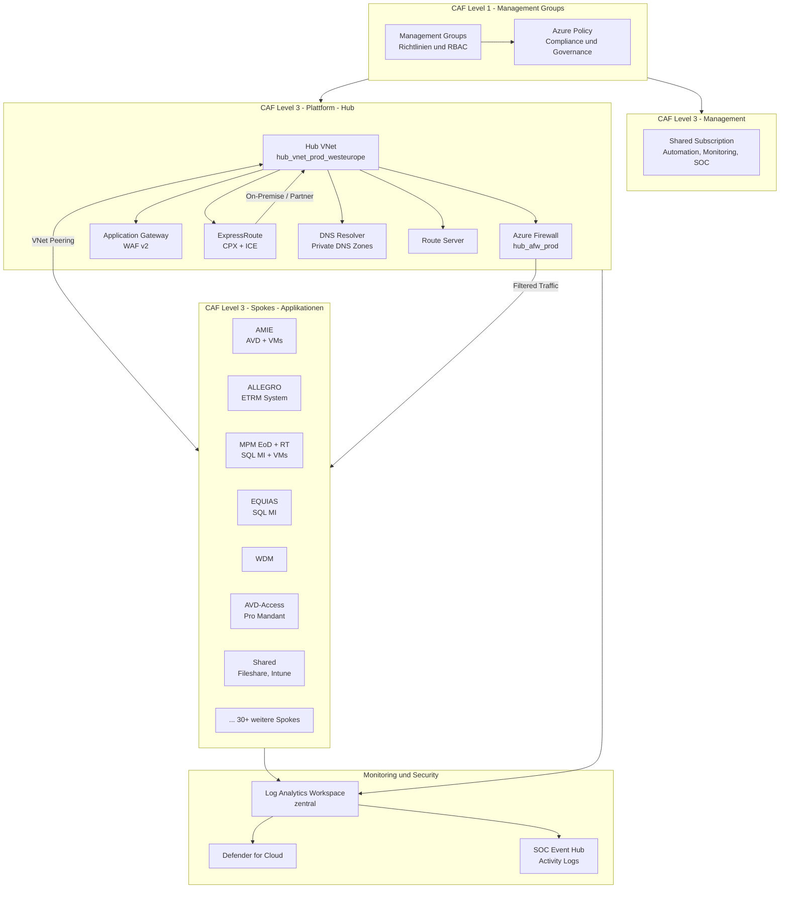
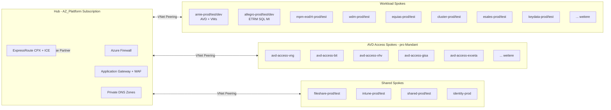
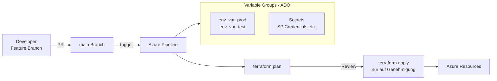

# VNG – Projektübersicht

> Schnelleinstieg für neue und bestehende Teammitglieder. Dieses Dokument beschreibt das VNG-Projekt, dessen Azure-Architektur, die wichtigsten Repositories und die täglichen Arbeitsabläufe.

---

## 1. Was ist VNG?

**VNG Handel & Vertrieb** ist ein Energiehandelsunternehmen. CraftingIT betreibt und entwickelt die Azure Cloud-Plattform für VNG als Managed Service (CloudOps).

| | |
|-|-|
| **Kunde** | VNG Handel & Vertrieb GmbH |
| **Azure DevOps Org** | `dev.azure.com/VNGHandelVertrieb` |
| **Hauptstandort** | West Europe (westeurope) |
| **Umgebungen** | `dev` / `test` / `devtest` / `uat` / `prod` |
| **IaC-Tool** | Terraform (via Azure Pipelines) |
| **Ticketsystem** | Jira (CraftingIT) + Azure DevOps Boards |

---

## 2. Azure-Architektur (Hub-and-Spoke)

VNG nutzt eine **Hub-and-Spoke Netzwerkarchitektur** nach dem Microsoft Cloud Adoption Framework (CAF).



---

## 3. Repository-Struktur

Alle Repos liegen unter `dev.azure.com/VNGHandelVertrieb` und werden lokal unter `CraftingIT/VNG/` geklont.

### Plattform-Repos (Infrastruktur-Basis)

| Repository | Beschreibung | CAF-Ebene |
|---|---|---|
| `Az_CAF_Level1` | Management Groups, Policies, RBAC, DNS Zones | Level 1 |
| `Az_CAF_Level1_Subscription_Management` | Subscription-Verwaltung | Level 1 |
| `AZ_CAF_Level3_Management` | Shared-Subscription: Automation, Monitoring, SOC | Level 3 |
| `AZ_CAF_Level3_Spokes` | Alle Spoke-VNets (30+ Applikationen) | Level 3 |
| `Az_CAF_Level3_Subscriptions` | Subscription-Erstellung und -Konfiguration | Level 3 |
| `AZ_Plattform` | Hub-VNet, Firewall, AppGW, ExpressRoute, DNS | Level 3 |

### Applikations-Repos

| Repository | Beschreibung | Technologie |
|---|---|---|
| `AZ_ALLEGRO` | ETRM-Handelssystem (CS, Lead, VHV) | SQL MI, VMs |
| `AZ_AMIE` | Azure Virtual Desktop + VMs | AVD, VMs |
| `AZ_AMIE_Scripts` | AVD Setup-Skripte (PowerShell) | PowerShell |
| `Az_MPM_EoD` | MPM End-of-Day | SQL MI |
| `Az_MPM_RT` | MPM Real-Time | SQL MI |
| `AZ_Equias` | Equias Handelssystem | SQL MI |
| `Az_WDM` | WDM Applikation | VMs, AppGW |
| `Az_Risk_DB` | Risk-Datenbank | SQL |
| `Az_Fileshare` | Zentraler Datei-Share | Azure Files |
| `Az_avd-access` | AVD-Zugriff pro Mandant (BIT, VHV, etc.) | AVD |
| `Az_Identity` | Entra ID / AAD Konfiguration | AAD |
| `Az_Intune` | Intune Device Management | Intune |
| `AZ_RemoteAccess` | VPN / Remote-Zugriff | VPN GW |
| `AZ_SOC` | Security Operations Center | Event Hub |
| `Az_ExpressRoute` | ExpressRoute Konfiguration | ER |
| `AZ_Database_Copy` | Datenbank-Kopier-Prozesse | SQL MI |

### Plattform-Services

| Repository | Beschreibung |
|---|---|
| `AZ_Plattform/AZ_Automation` | Automation Account + Renovate-Bot (Container App) |
| `AZ_Plattform/AZ_Monitoring` | Log Analytics, Defender, Alerting |
| `AZ_Plattform/Az_Image_Builder` | VM-Image-Erstellung (AVD / AMIE) |

### Shared-Infrastruktur-Module

| Repository | Beschreibung |
|---|---|
| `AZ_Infrastructure` | Wiederverwendbare Terraform-Module (intern) |
| `AZ_Pipeline` | Shared Azure DevOps Pipeline-Templates |

---

## 4. Netzwerk-Topologie (Spokes)

Der Hub befindet sich in der **AZ_Plattform**-Subscription. Alle Spokes werden in `AZ_CAF_Level3_Spokes` per Terraform verwaltet und via VNet-Peering mit dem Hub verbunden.



---

## 5. CI/CD Pipeline-Modell

Alle Terraform-Repos nutzen dasselbe Pipeline-Template aus `AZ_Pipeline`.



- **Branch-Modell:** `feature/*` oder `service/*` → PR → `main`
- **Terraform Apply:** Manuell gesteuert via Pipeline-Parameter `tf_apply: true`
- **Umgebungstrennung:** Separate Pipelines pro Umgebung (`azure-pipelines-prod.yml`, `azure-pipelines-test.yml`)

---

## 6. Wichtige Azure-Ressourcentypen

| Ressource | Einsatz im Projekt |
|---|---|
| Azure Virtual Desktop (AVD) | AMIE-Desktops, mandantenspezifische Zugänge |
| SQL Managed Instance | ALLEGRO, MPM, EQUIAS, Risk-DB |
| Azure Firewall | Zentraler Netzwerk-Traffic-Filter im Hub |
| Application Gateway + WAF | HTTPS-Eingang für Web-Applikationen |
| ExpressRoute | On-Premise-Anbindung (CPX, ICE) |
| Log Analytics Workspace | Zentrales Monitoring & Alerting |
| Defender for Cloud | Security Posture Management |
| Key Vault | Secret-Verwaltung pro Applikation |
| Container App | Renovate-Bot (Dependency Updates) |
| Automation Account | Runbooks (z.B. App-Registration Monitoring) |
| Private DNS Zones | Interne Namensauflösung im Hub |

---

## 7. Ticketworkflow

```
Jira Ticket (VCP-xxx / VNGIA-xxx)
    --> Feature/Service Branch erstellen
    --> Terraform-Änderungen implementieren
    --> terraform plan prüfen
    --> Pull Request erstellen
    --> Code Review (Kollege)
    --> Merge in main
    --> Pipeline-Apply (ggf. Change Request nötig)
    --> Ticket schließen
```

- **VCP-xxx** = Service/Support-Tickets (Incidents, Changes, Problems)
- **VNGIA-xxx** = Weiterentwicklung / Feature-Tickets (ADO Boards)
- **Change Requests** sind für Prod-Deployments mit Kundenauswirkung erforderlich

---

## 8. Schnellreferenz – Wichtige Links

| Ressource | Link |
|---|---|
| Azure DevOps | `https://dev.azure.com/VNGHandelVertrieb` |
| Jira | `https://craftingit.atlassian.net` |
| Azure Portal | `https://portal.azure.com` |
| Branching-Workflow | [03_Wissen/02_Prozesse/branching-und-pr-workflow.md](../03_Wissen/02_Prozesse/branching-und-pr-workflow.md) |
| Terraform Plan/Apply | [03_Wissen/02_Prozesse/terraform-plan-apply.md](../03_Wissen/02_Prozesse/terraform-plan-apply.md) |
| Change-Request-Prozess | [03_Wissen/02_Prozesse/change-request-prozess.md](../03_Wissen/02_Prozesse/change-request-prozess.md) |
| Einarbeitung | [Einarbeitung-VNG.md](../Einarbeitung-VNG.md) |
| Continuous Improvement POC | [VNG-POC-Continuous-Improvement-2026-06.md](./VNG-POC-Continuous-Improvement-2026-06.md) |

---

## 9. Security Operations und Verantwortlichkeiten

### Grundsatz (RACI-orientiert)

- **Plattform-Team (CloudOps):** Betrieb der Azure-Plattform, Baseline-Hardening, Image-Lifecycle, Nachweisbarkeit (Plan/Apply, Artefakte, Dokumentation).
- **Applikationsverantwortliche:** Fachliche Verantwortung fuer eingesetzte Third-Party-Komponenten und Freigabe fachlicher Risiken.
- **IT-Security:** Bewertung von Schwachstellen, Kritikalitaet, Fristen, Priorisierung und Eskalation.

### Vorgehen bei Third-Party-Schwachstellen (z. B. pgAdmin)

1. Betroffene Systeme identifizieren (Defender, ARG, Inventar).
2. Installationspfad klaeren (Golden Image, Skript, manuell).
3. Sofortmassnahme fuer Exposition festlegen (z. B. Zugriff einschränken oder kurzfristig patchen).
4. Nachhaltige Behebung ueber Image-Update und geregeltes Redeployment umsetzen.
5. Abschluss mit Evidenzen dokumentieren (Version vorher/nachher, betroffene VMs, Zeitstempel).

### Antwortbaustein fuer die Rueckfrage "Wie wurde pgAdmin installiert?"

"Nach aktueller Analyse wird pgAdmin in den betroffenen AVD-Umgebungen nicht zentral ueber ein dediziertes Terraform-Ressourcenobjekt installiert, sondern ueber den bereitgestellten VM-/Golden-Image-Stand in die Session Hosts getragen. Deshalb ist der nachhaltige Fix ein Image-Update auf den freigegebenen Zielstand (9.15) plus gesteuertes Redeployment der Hosts. Fuer den kurzfristigen Zeitraum koennen wir zusaetzlich eine manuelle/Uebergangs-Massnahme fahren, bis alle Hosts auf dem neuen Image laufen." 

---

## 10. Verbesserungen fuer das Projekt (Continuous Improvement)

1. **Software Bill of Materials fuer Images**
: Pro Image-Version eine nachvollziehbare Komponentenliste (inkl. Versionen und Build-Datum) ablegen.
2. **Verantwortungsmatrix pro Komponente**
: Third-Party-Tools mit Owner, Security-Owner und Freigabeprozess dokumentieren.
3. **Image-Patch-Policy**
: Monatlicher Patch-Zyklus mit klaren Kriterien fuer ausserplanmaessige Sicherheitsupdates.
4. **Automatisierte Version-Checks**
: Pipeline-/Runbook-Check fuer kritische Tools (z. B. pgAdmin), inklusive Alerting bei Drift.
5. **Incident-Runbook Security**
: Standardisiertes Runbook fuer CVE-Incidents mit festen Schritten, Zeitvorgaben und Evidenzen.
6. **Redeployment-Playbook AVD**
: Einheitliches Vorgehen fuer Rolling-Redeploy inkl. Kommunikations- und Fallback-Plan.

---

> Letzte Aktualisierung: 01.06.2026 | Autor: Romeo Pikop
